# HarborDemo
some usage for the Harbor(goHarbor), Docker, Apptainer(Singularity) for the Ubuntu20.04.

## 1.What is Harbor?
Harbor is an open-source container image registry that secures images with role-based access control, scans images for vulnerabilities, and signs images as trusted. It is designed to store, manage, and deploy container images in a secure environment. Harbor extends the open-source Docker Distribution by adding the functionalities often required by an enterprise, such as security, identity, and management.(from gpt4-turbo)

Maybe, it is still incomprehensible, as shown in the image.  
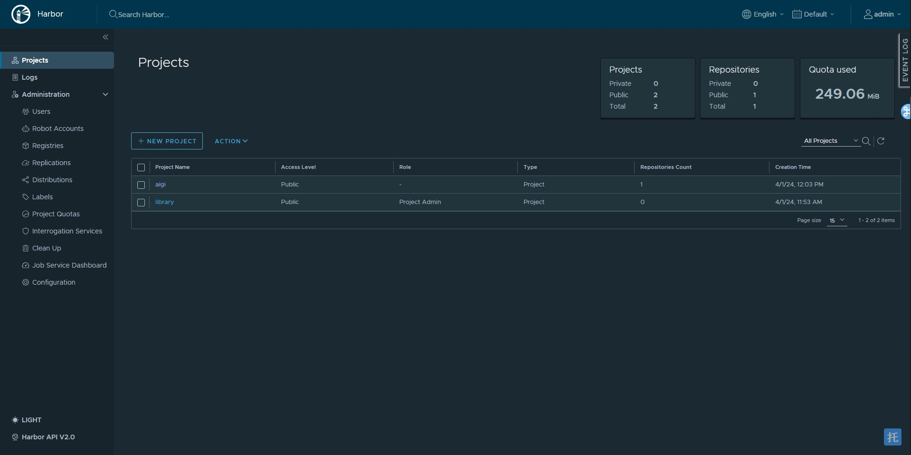

## 2. How to DOWNLOAD Harbor?
Download link: https://github.com/goharbor/harbor/releases
In this markdown, I choose harbor 2.10.1 version.  
Actually, it is divided into online version(https://github.com/goharbor/harbor/releases/download/v2.10.1/harbor-online-installer-v2.10.1.tgz) and offline version(https://github.com/goharbor/harbor/releases/download/v2.10.1/harbor-offline-installer-v2.10.1.tgz).  
Linux OS: to ***wget*** the link.

## 3. How to INSTALL Harbor?

Version | Directory
---- | ----  
Online | 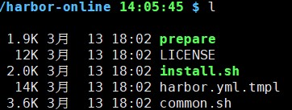  
Offline | 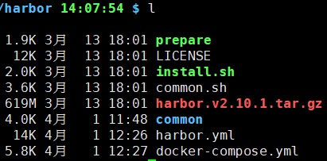  

Step A. to edit your hostname, http.port, https, harbor_admin_password, database.password config  
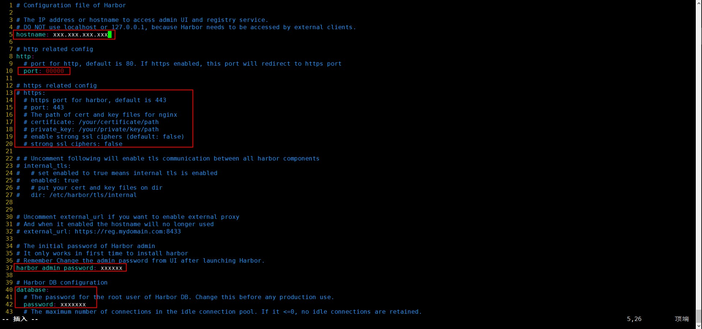
Step B. to bash the ***preprare*** file  
```
prepare

-WARNING:root:WARNING: HTTP protocol is insecure. Harbor will deprecate http protocol in the future. Please make sure to upgrade to https
-Generated configuration file: /config/portal/nginx.conf
-Generated configuration file: /config/log/logrotate.conf
-Generated configuration file: /config/log/rsyslog_docker.conf
-Generated configuration file: /config/nginx/nginx.conf
-Generated configuration file: /config/core/env
-Generated configuration file: /config/core/app.conf
-Generated configuration file: /config/registry/config.yml
-Generated configuration file: /config/registryctl/env
-Generated configuration file: /config/registryctl/config.yml
-Generated configuration file: /config/db/env
-Generated configuration file: /config/jobservice/env
-Generated configuration file: /config/jobservice/config.yml
-loaded secret from file: /data/secret/keys/secretkey
-Generated configuration file: /compose_location/docker-compose.yml
```
Step C. to bash the ***install.sh*** file
```
sudo bash install.sh
```
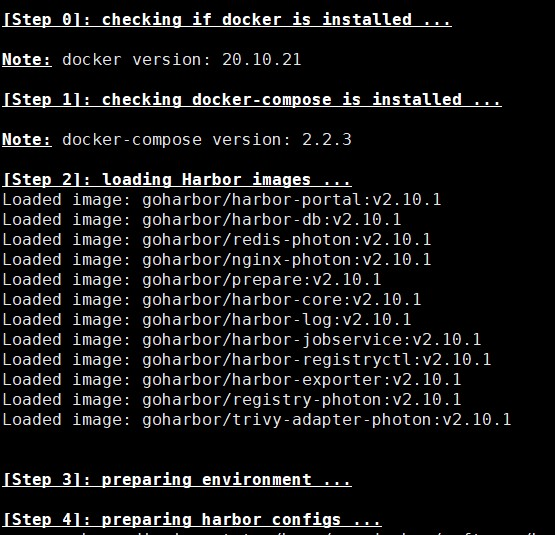  
if the last note is **permission denied**, to improve your OS privileges.  
## 4. How to start Harbor on boot?
To find the path about /lib/systemd/system, figure out by systemctl  
a. torch a file, named **harbor.service**
b. edit the following code in the harbor.service
```
[Unit]
Decription=Harbor app
After=docker.service systemd-network.service systemd-reloadved.service
Requires=docker.service
Documentation=https://goharbo.io/
[Service]
Type=simple
Restart=on-failure
ExecStart=/usr/local/bin/docker-compose -f your_harbor_path/docker-compose.yml up
ExecStop=/usr/local/bin/docker-compose -f your_harbor_path/docker-compose.yml down
[Install]
WantedBy=multi-user.target
```
c. sudo systemctl enable harbor(add to the booting start)  
## 5. How to push the remoted docker images?
Here, I example a docker images of mongodb.  
a. the images is existed.
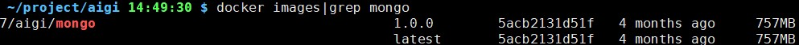  
b. test the login  
***Failed***
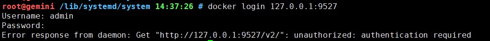
***Succeeded***
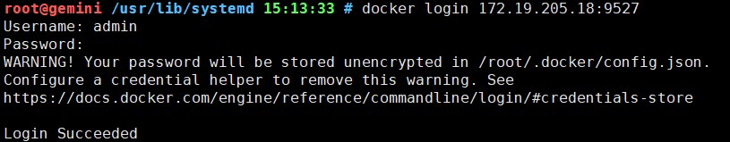  
c. if failed, edit the /etc/docker/daemon.json
```
{
   "insecure-registries": ["YOUR HARBOR URL"]
}
sudo systemctl daemon-reload
sudo systemctl restart docker
```
d. if succeeded, to make a docker tag(unnecessary)  
*Attention*: the image ID is the same the image below, it means the bottom one is the real docker images. the others is docker tag.  
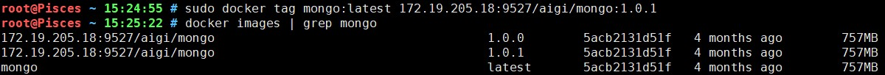
e. to push the docker images(or docker tag), after login the harbor
```
docker login 172.19.205.18:9527
...Login Succeeded...
sudo docker push mongo:1.0.0 172.19.205.21:28017/aigi/mongo:latest
```
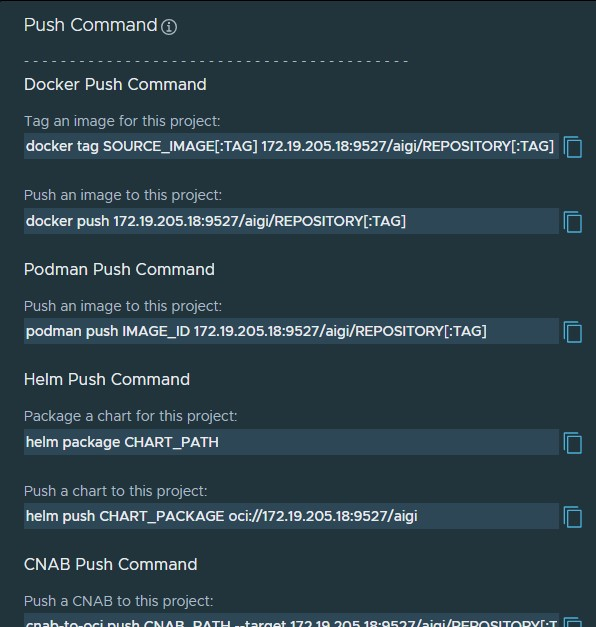
*Repository*:
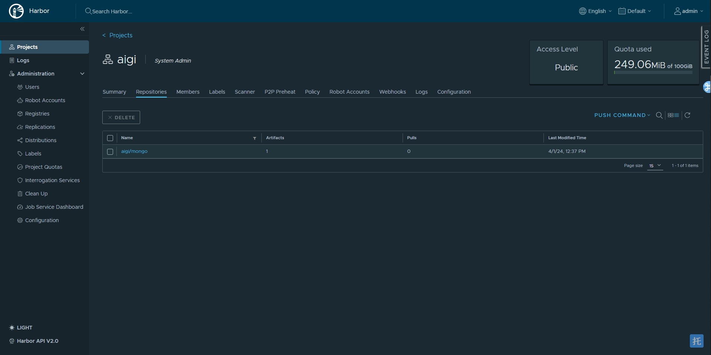
Finally, the member of your project could take your image to do the next step.
